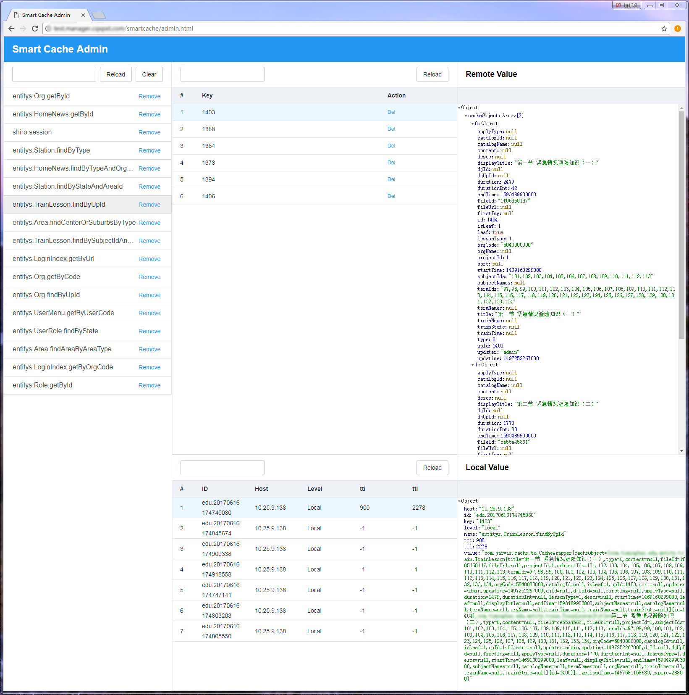
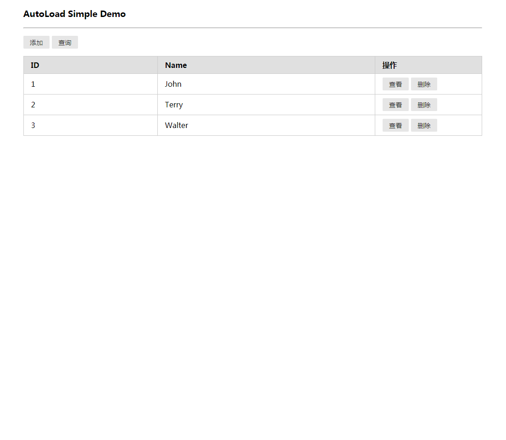

# smart-cache

## Introduce

Java distributed second-level cache, which is achieved based on Ehcache2 and Redis, **can realize cache monitoring and fetching of multi-computer cluster at all levels besides basic operations.**

- Synchronize the stand-alone cache to the Redis caching-system in a specific structure to achieve  
 the unified management of the global cache.
- Establish CacheManager and StoreLocation with codes dynamically to get rid of annoying ehcache.xml configuration files and prevent the cache from becoming out of sync when the service needs to be restarted or stop working. 
- Replace the native hash type of Redis with the self-maintained hash data structure to make the expiration time of each cache element controllable.
- Adopt Redis.Topic mechanism to realize cache synchronization.
- Provide cache management monitoring pages.
- Implement the fetching function of multi-machine local cache.
- Realize easy operation for its similarity to the API of Jedis.
- Minimize the configuration and packaging, striving to be streamlined.

## 项目介绍

基于Ehcache2和Redis实现的Java分布式二级缓存.除基本操作以外实现**多机集群时各级缓存的监管和抓取**.

- 将单机缓存以特定结构同步至Redis存储,实现全局缓存统一管理.
- 编码方式动态创建CacheManager和StoreLocation.摆脱了烦人的ehcache.xml配置文件,同时避免服务重启或不可用时缓存未同步的问题．
- 使用自身维护的hash数据结构,替换Redis原生的hash类型,实现每个缓存元素过期时间可控.
- 使用Redis.Topic机制.实现缓存同步.
- 提供缓存管理监控页面.
- 实现多机本地缓存抓取功能.
- 类似Jedis的API,使用简便.
- 尽可能减少配置和封装,力求精简,够用即可.

开源地址:
[github](https://github.com/yrain/smart-cache)
[oschina](http://git.oschina.net/yrain/smart-cache)


## 使用方式

- cmd

```bash
mvn clean install -Dmaven.test.skip=true
```

- pom.xml

```xml
<dependency>
	<groupId>com.smart</groupId>
	<artifactId>smart-cache</artifactId>
	<version>${VERSION}</version>
</dependency>
```

- spring.xml

```xml
<!-- Redis -->
<bean id="jedisPoolConfig" class="redis.clients.jedis.JedisPoolConfig">
	<property name="maxTotal" value="${redis.max.total:1024}"/>
	<property name="minIdle" value="${redis.min.idle:256}"/>
	<property name="maxIdle" value="${redis.max.idle:256}"/>
	<property name="maxWaitMillis" value="${redis.max.wait.millis:3000}"/>
</bean>

<bean id="jedisPool" class="redis.clients.jedis.JedisPool">
	<constructor-arg name="poolConfig" ref="jedisPoolConfig" />
	<constructor-arg name="host" 	   value="${redis.host}" />
	<constructor-arg name="port" 	   value="${redis.port}" />
</bean>

<bean id="jedisTemplate" class="com.smart.jedis.JedisTemplate">
	<property name="jedisPool" ref="jedisPool" />
</bean>

<!-- Smart Cache -->
<bean id="cacheTemplate" class="com.smart.cache.CacheTemplate" destroy-method="shutdown">
	<property name="jedisTemplate" ref="jedisTemplate" />
</bean>
```

- 代码示例

```java
cacheTemplate.set(name, key, value);// 设置
cacheTemplate.get(name, key);// 获取
cacheTemplate.del(name, key);// 删除
cacheTemplate.rem(name);// 删除name下所有缓存
cacheTemplate.cls();// 清空所有缓存
cacheTemplate.fetch(name, key);// 抓取集群下所有单机一级缓存
cacheTemplate.ttl(name, key, level);// 获取缓存ttl
cacheTemplate.names();// 获取所有缓存name
cacheTemplate.keys(name);// 获取name下所有key
cacheTemplate.size(name);// 获取name下缓存数量
cacheTemplate.values(name);// 获取name下缓存值
```

见:smart-cache/src/test/java/com/smart/cache/App.java


## 与Spring Cache联用

- spring.xml

```xml
<cache:annotation-driven cache-manager="cacheManager" proxy-target-class="true"/>

<bean id="cacheManager" class="com.smart.cache.spring.CacheManager">
	<property name="cacheTemplate" ref="cacheTemplate" />
</bean>
```

## 与[AutoLoadCache](https://github.com/qiujiayu/AutoLoadCache)联用

- pom.xml

```xml
<dependency>
	<groupId>com.smart</groupId>
	<artifactId>smart-cache-autoload</artifactId>
	<version>${VERSION}</version>
</dependency>
```

- spring.xml

```xml
<bean id="cacheTemplateManager" class="com.smart.cache.autoload.CacheManager" destroy-method="destroy">
	<constructor-arg ref="autoLoadConfig" />
	<constructor-arg ref="cacheSerializer" />
	<constructor-arg ref="scriptParser" />
	<constructor-arg ref="cacheTemplate" />
</bean>
```

## 缓存监控

- web.xml

```xml
	<servlet>
		<servlet-name>SmartCache</servlet-name>
		<servlet-class>com.smart.servlet.CacheAdminServlet</servlet-class>
		<init-param>
			<param-name>username</param-name>
			<param-value>admin</param-value>
		</init-param>
		<init-param>
			<param-name>password</param-name>
			<param-value>admin</param-value>
		</init-param>
	</servlet>
	<servlet-mapping>
		<servlet-name>SmartCache</servlet-name>
		<url-pattern>/smartcache/*</url-pattern>
	</servlet-mapping>
```


## 项目演示

### 监控页面

- 登录页面:http://localhost:8080/smartcache/login.html
- 用户密码:admin/admin
- 监控页面:http://localhost:8080/smartcache/admin.html
- 页面截图:



### Showcase.AutoLoadCache

- 演示页面:http://localhost:8080/view/autoload/user.html
- 页面截图:



### Showcase.Spring Cache

- 查询缓存:http://localhost:8080/showcase/springcache/user/find
- 添加数据:http://localhost:8080/showcase/springcache/user/create


注意:
若修改了序列化方式,务必清空Redis上原缓存数据

## 完整配置

```xml
<!-- Serializer -->
<bean id="stringSerializer" class="com.smart.serializer.StringSerializer" />
<bean id="fstSerializer" class="com.smart.serializer.FSTSerializer" />
<bean id="fastjsonSerializer" class="com.smart.serializer.FastjsonSerializer" />

<!-- Redis -->
<bean id="jedisPoolConfig" class="redis.clients.jedis.JedisPoolConfig">
	<property name="maxTotal" value="${redis.max.total:1024}"/>
	<property name="minIdle" value="${redis.min.idle:256}"/>
	<property name="maxIdle" value="${redis.max.idle:256}"/>
	<property name="maxWaitMillis" value="${redis.max.wait.millis:3000}"/>
</bean>

<bean id="jedisPool" class="redis.clients.jedis.JedisPool">
	<constructor-arg name="poolConfig" ref="jedisPoolConfig" />
	<constructor-arg name="host" 	   value="${redis.host}" />
	<constructor-arg name="port" 	   value="${redis.port}" />
</bean>

<bean id="jedisTemplate" class="com.smart.jedis.JedisTemplate">
	<property name="jedisPool" ref="jedisPool" />
	<property name="keySerializer" ref="stringSerializer" /><!-- key默认使用string序列化 -->
	<property name="valSerializer" ref="fstSerializer" />   <!-- val默认使用fst序列化 -->
</bean>

<!-- Smart Cache -->
<bean id="cacheTemplate" class="com.smart.cache.CacheTemplate" destroy-method="shutdown">
	<property name="key" value="smart" /><!-- Redis前缀 -->
	<property name="spliter" value=":" /><!-- Redis分隔符 -->
	<property name="localEnabled" value="true" /><!-- 是否启用本地缓存  -->
	<property name="setCmdEnabled" value="false" /><!-- 是否启用set通知  -->
	<property name="localStoreLocation" value="/cache/" /><!-- 本地缓存存储磁盘位置  -->
	<property name="localMaxBytesLocalHeap" value="128M" /><!-- 本地缓存最大内存大小 -->
	<property name="localMaxBytesLocalDisk" value="1024M" /><!-- 本地缓存最大磁盘大小  -->
	<property name="localTimeToLiveSeconds" value="600" /><!-- 本地缓存10分钟过期  -->
	<property name="localDiskExpiryThreadIntervalSeconds" value="180" /><!-- 本地缓存3分钟清理一次  -->
	<property name="fetchTimeoutSeconds" value="3" /><!-- fetch命令最长等待3秒  -->
	<property name="jedisTemplate" ref="jedisTemplate" /><!-- jedis操作类  -->
</bean>
```

见:smart-cache/src/test/java/spring.xml


## Redis集群配置

```xml
<bean id="jedisCluster" class="redis.clients.jedis.JedisCluster">  
	<constructor-arg index="0">  
		<set>  
			<bean class="redis.clients.jedis.HostAndPort">  
				<constructor-arg index="0" value="192.168.1.157" />  
				<constructor-arg index="1" value="3001" type="int" />  
			</bean>  
			<bean class="redis.clients.jedis.HostAndPort">  
				<constructor-arg index="0" value="192.168.1.157" />  
				<constructor-arg index="1" value="3002" type="int" />  
			</bean>  
			<bean class="redis.clients.jedis.HostAndPort">  
				<constructor-arg index="0" value="192.168.1.157" />  
				<constructor-arg index="1" value="3003" type="int" />  
			</bean>
			<bean class="redis.clients.jedis.HostAndPort">  
				<constructor-arg index="0" value="192.168.1.157" />  
				<constructor-arg index="1" value="3004" type="int" />  
			</bean>
			<bean class="redis.clients.jedis.HostAndPort">  
				<constructor-arg index="0" value="192.168.1.157" />  
				<constructor-arg index="1" value="3005" type="int" />  
			</bean>
			<bean class="redis.clients.jedis.HostAndPort">  
				<constructor-arg index="0" value="192.168.1.157" />  
				<constructor-arg index="1" value="3006" type="int" />  
			</bean>
		</set>  
	</constructor-arg>  
	<constructor-arg index="1" value="2000" type="int"></constructor-arg>
	<constructor-arg index="2" value="100" type="int"></constructor-arg>
	<constructor-arg index="3" ref="jedisPoolConfig"></constructor-arg>
</bean>
	
<bean id="jedisTemplate" class="com.smart.jedis.JedisTemplate">
	<property name="jedisCluster" ref="jedisCluster"/>
</bean>
```


## Redis密码配置

```xml
<bean id="jedisPool" class="redis.clients.jedis.JedisPool" destroy-method="destroy">
	<constructor-arg index="0" ref="jedisPoolConfig" />
	<constructor-arg index="1" value="${redis.host}" />
	<constructor-arg index="2" value="${redis.port}" />
	<constructor-arg index="3" value="${redis.timeout:3000}" />
	<constructor-arg index="4" value="${redis.pass}" />
</bean>
```


## 建议咨询
QQ:20365124
email:yrain@live.cn